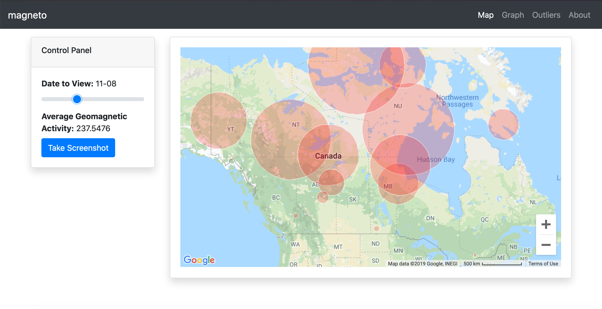

# NASA/CSA SpaceApps Ottawa 2019: Magneto

We analyzed a bunch of CSA geomagnetic data in an attempt to
find electromagnetic interference caused by non-geomagnetic
events.

## instructions
- clone this project `https://github.com/filipp-g/magneto.git`
- install dependencies `pip install -r requirements.txt`
- run server `python app.py`
- navigate to `localhost:5000`
